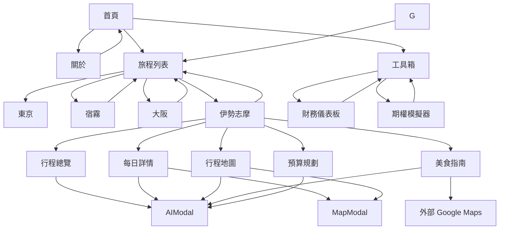

# 網站地圖 (Sitemap)

> 最後更新：2026-06-07

## 視覺化結構

> **路由方式**：主站採 `HashRouter`（GitHub Pages 不支援 SPA rewrite），
> 所有主選單頁面的網址是 `/me/#/xxx`，**不是** `/me/xxx/`。
> 各旅程詳情頁則是獨立的 Vite 入口，為實體目錄 `/me/trips/{trip}/`。

```
🏠 首頁 (index.html)
│
├── 👤 ABOUT (#/about)
│   └── ← 返回首頁
│
├── ✈️ SELECT TRIP (#/trips)
│   ├── 🗼 2026 東京 (trips/2026-tokyo/) [Vite+React]
│   │   ├── 📋 行程總覽 (overview)
│   │   ├── 📅 每日詳情 (itinerary)
│   │   ├── 🧭 交通地圖 (map)
│   │   ├── 🌲 景點分頁 (attraction) ✨ NEW
│   │   ├── 🍽️ 美食指南 (food)
│   │   ├── 🛒 購物清單 (shopping)
│   │   ├── 🏨 住宿資訊 (accommodation)
│   │   └── 💰 預算規劃 (budget)
│   ├── 🏝️ 2026 沖繩 (trips/2026-okinawa/) [Vite+React] ✨ NEW
│   │   ├── 📋 行程總覽 (overview)
│   │   ├── 📅 每日詳情 (itinerary)
│   │   ├── 🧭 交通地圖 (map)
│   │   ├── 🌲 景點分頁 (attraction)
│   │   ├── 🍽️ 美食指南 (food)
│   │   ├── 🛒 購物清單 (shopping)
│   │   ├── 🏨 住宿資訊 (accommodation)
│   │   └── 💰 預算規劃 (budget)
│   ├── 🌴 2025 宿霧 (trips/2025-cebu/)
│   ├── 🏯 2025 大阪 (trips/2025-osaka/)
│   ├── 🦐 2026 伊勢志摩 (trips/2026-ise-shima/) [Vite+React]
│       ├── 📋 行程總覽 (overview)
│       │   ├── 航班資訊
│       │   ├── 行程概覽 (Timeline)
│       │   ├── 行程亮點
│       │   └── 實用連結
│       ├── 📅 每日詳情 (itinerary)
│       │   ├── 第一階段：伊勢志摩慢旅
│       │   └── 第二階段：Day 7-10
│       ├── 🗺️ 行程地圖 (map)
│       │   ├── 近鐵特急比較表
│       │   ├── 巴士時刻表
│       │   └── 每日路徑總覽
│       ├── 🍽️ 美食指南 (food)
│       │   ├── 臨空城
│       │   ├── VISON 園區
│       │   ├── 伊勢 托福橫丁
│       │   ├── 賢島
│       │   ├── 大阪 梅田
│       │   └── USJ 環球影城
│       ├── 🛍️ 購物清單 (shopping)
│       │   └── 美妝購物攻略 v13.0
│       └── 💰 預算規劃 (budget)
│   ├── 🏰 2024 東京迪士尼 (trips/2024-tokyo-disney/) [Vite+React・回顧型] ✨ NEW
│   │   └── 8 頁籤結構同 2026 東京（資料源為旅行社行程表 PDF + 紙本收據回顧）
│   └── 🍵 2024 京都 (trips/2024-kyoto/) [Vite+React・回顧型]
│       └── 8 頁籤結構同 2026 東京（資料源為 Google Maps 時間軸回顧）
│
├── 📓 JOURNAL (#/journal)
│   └── Vibe Coding 日記
│
└── 🔧 TOOLS & CONTACT (#/tools)
    ├── 📊 財務儀表板 (tools/financial-dashboard.html)
    ├── 📈 期權策略模擬器 (tools/bull-put-spread.html)
    ├── 🏛️ CB 戰情室 (tools/cb-war-room.html) [整合中心]
    ├── 🧮 舊版計算機 (tools/archive/cb-calculator-standalone.html) [封存]
    ├── 🤖 台股分析自動化 (tools/stock-analyzer/) [Vite+React]
    └── 📧 聯絡方式
```

## 頁面清單

| 頁面 | 路徑 | 狀態 | 架構 |
| -------------- | ---------------------------------------------- | --------- | ------------ | --- |
| 首頁           | `/index.html`                                  | ✅ 完成   | Vite+React   |
| 關於           | `/#/about`                                     | ✅ 完成   | Vite+React   |
| 旅程列表       | `/#/trips`                                     | ✅ 完成   | Vite+React   |
| 工具箱         | `/#/tools`                                     | ✅ 完成   | Vite+React   |
| 2025 宿霧      | `/trips/2025-cebu/index.html`                  | ✅ 完成   | CDN+Babel    |
| 2026 東京      | `/trips/2026-tokyo/index.html`                 | ✅ 完成   | Vite+React   |
| 2026 沖繩      | `/trips/2026-okinawa/index.html`               | ✅ 完成   | Vite+React   |
| 2025 大阪      | `/trips/2025-osaka/index.html`                 | 🚧 建置中 | CDN+Babel    |
| 2026 伊勢志摩  | `/trips/2026-ise-shima/index.html`             | ✅ 完成   | Vite+React   |
| 2024 東京迪士尼 | `/trips/2024-tokyo-disney/index.html`         | ✅ 完成   | Vite+React   |
| 2024 京都      | `/trips/2024-kyoto/index.html`                 | ✅ 完成   | Vite+React   |
| 日記           | `/#/journal`                                   | ✅ 完成   | Vite+React   |
| 財務儀表板     | `/tools/financial-dashboard.html`              | ✅ 完成   | CDN+Vanilla  | \r  |
| 期權模擬器     | `/tools/bull-put-spread.html`                  | ✅ 完成   | CDN+Vanilla  | \r  |
| CB 戰情室      | `/tools/cb-war-room.html`                      | ✅ 完成   | 終極整合終端 | \r  |
| 舊版計算機     | `/tools/archive/cb-calculator-standalone.html` | 📦 封存   | CDN+Vanilla  | \r  |
| 台股分析自動化 | `/tools/stock-analyzer/`                       | ✅ 完成   | Vite+React   | \r  |

## 旅程詳情頁分頁結構

以 **2026 伊勢志摩** 為例，每個旅程詳情頁包含以下分頁：

| 分頁 ID     | 圖示          | 名稱     | 功能                       |
| ----------- | ------------- | -------- | -------------------------- |
| `overview`  | 🗺️ MapIcon    | 行程總覽 | 亮點、階段摘要、實用連結   |
| `itinerary` | 📅 Calendar   | 每日詳情 | 可折疊的每日行程卡片       |
| `map`       | 🧭 Navigation | 行程地圖 | 交通資訊、時刻表、路線總覽 |
| `food`      | 🍽️ Utensils   | 美食指南 | 分區餐廳列表、收藏功能     |
| `budget`    | 💰 Wallet     | 預算規劃 | 費用明細表                 |

## Modal 彈窗

| 彈窗         | 觸發方式               | 功能                |
| ------------ | ---------------------- | ------------------- |
| **MapModal** | 點擊活動項目的地圖圖示 | 嵌入 Google Maps    |
| **AIModal**  | 點擊右下角 FAB 按鈕    | AI 聊天、素食溝通卡 |

## 導航流程



## URL 參數

| 頁面 | 參數                  | 說明                       |
| ---- | --------------------- | -------------------------- |
| 首頁 | `?booted=true#booted` | 跳過開機動畫，直接進入選單 |
